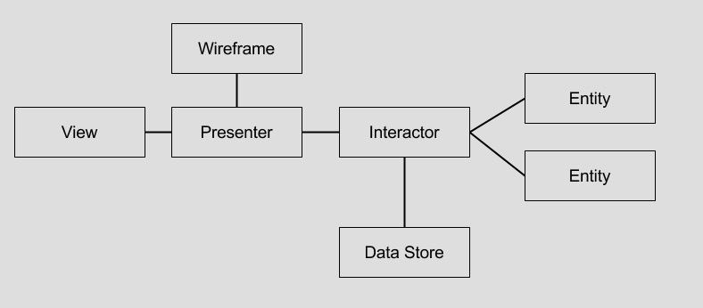

# Arch_vip
Arch_vip是对于viper架构的的简单实践，这里是一个模拟登陆的小例子，目前只实现了viper三层结构：View、Interactor、Presenter，只便快速理解VIP分层结构的概念。要想了解 Jeff Gilbert和Conrad Stoll完整的VIPER的架构理念，请参看https://www.objc.io/issues/13-architecture/viper/

# VIPER架构的演化
苹果的设计最初就是按照MVC的模式进行划分，Model-View-Controller，但是大多数的没有经过架构规划的项目中，UIController里面随着业务逻辑的不断累积，经常会变得非常臃肿，MVC经常也就笑称为Massive-View-Controller。无论是对于多人协作开发、后期维护以及调试测试都是非常麻烦的事情，因此业内也出现了很多瘦Controller的理念和方案，比如我们经常所听到的MVP、MVVM等等，这里我想讲一讲VIPER。VIPER起源于[Clean Architecture](https://8thlight.com/blog/uncle-bob/2012/08/13/the-clean-architecture.html)，我先看一下VIPER的架构图：

- V：View视图，用户界面显示以及用户事件的收集和转发，并非是UIView及其子类，通常包含但不限于UIView、UIViewController。

- I：Interactor层，进行核心业务逻辑的处理，以User Case的形式请求数据以及完成相应的业务逻辑。

- P:Presenter展示层，主要处理用户事件，从Interactor层获取原始数据，然后转换成界面逻辑数据以便View层进行显示。另外，路由器Router一般是在Presenter中，以进行路由的操作。

- E:Entity层，最纯粹的实体对象，供Interactor使用，不包含任何业务逻辑。

- R:Router路由器，进行视图的跳转，决定了以何种顺序进行哪个界面的显示。注意，这里的Router对象是绑定注入的方式，不能设计成直接跳转。

# URL类图
以下是demo的整体UML类图设计：

## 设计分层
从类图设计，我们很容易看出，View、Interactor、Presenter的三层结构，其中每一层都有自己的职责，并且各自的职责的非常清晰，LoginView继承ViewController（这里偷了懒哈），进行界面的展示，登陆事件由LoginView下挂的LoginPresenter进行处理，在LoginPresenter里面调LoginInteractor进行登陆请求，拿到登陆结果以后，在LoginPresenter的loginsuccess和loginfail进行登陆结果数据的处理，然后再交由LoginView进行显示。
说明一下，demo里面并没有实现Router跳转，只是进行Alert弹框，所以在UIView里面处理的，实现了Router的情况，在LoginPresenter的loginsuccess方法里面调router进行跳转即可。
