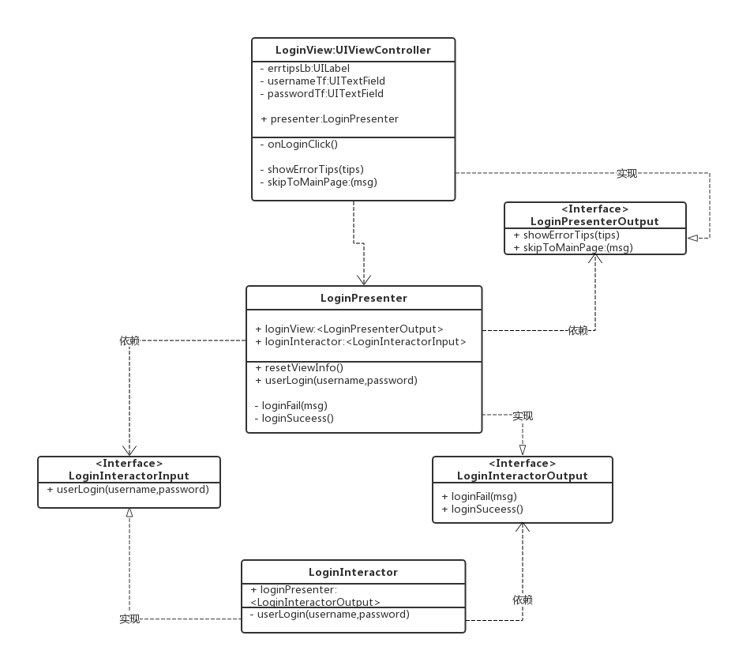

# Arch_vip
Arch_vip是对于viper架构的的简单实践，这里是一个模拟登陆的小例子，目前只实现了viper三层结构：View、Interactor、Presenter，这样更能快速理解VIP分层结构的概念。要想了解 Jeff Gilbert和Conrad Stoll完整的VIPER的架构理念，请参看https://www.objc.io/issues/13-architecture/viper/

## URL类图
以下是demo的整体UML类图设计：

## demo说明
从类图设计，我们很容易看出，View、Interactor、Presenter的三层结构，其中每一层都有自己的职责，并且各自的职责的非常清晰，LoginView继承ViewController（这里偷了懒哈），进行界面的展示，登陆事件由LoginView下挂的LoginPresenter进行处理，在LoginPresenter里面调LoginInteractor进行登陆请求，拿到登陆结果以后，在LoginPresenter的loginsuccess和loginfail进行登陆结果数据的处理，然后再交由LoginView进行显示。 

说明一下，demo里面并没有实现Router跳转，只是进行Alert弹框，所以在UIView里面处理的，实现了Router的情况，在LoginPresenter的loginsuccess方法里面调router进行跳转即可。 

另外，View、Interactor、Presenter进行交互时，进行的是双向数据流转，因此尽量需要通过Protocol协议去进行解藕，使之层与层之间依赖于抽象。 

